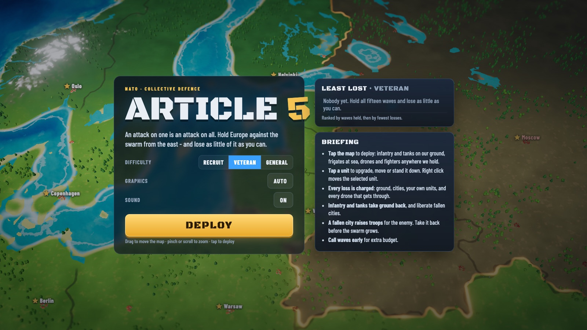
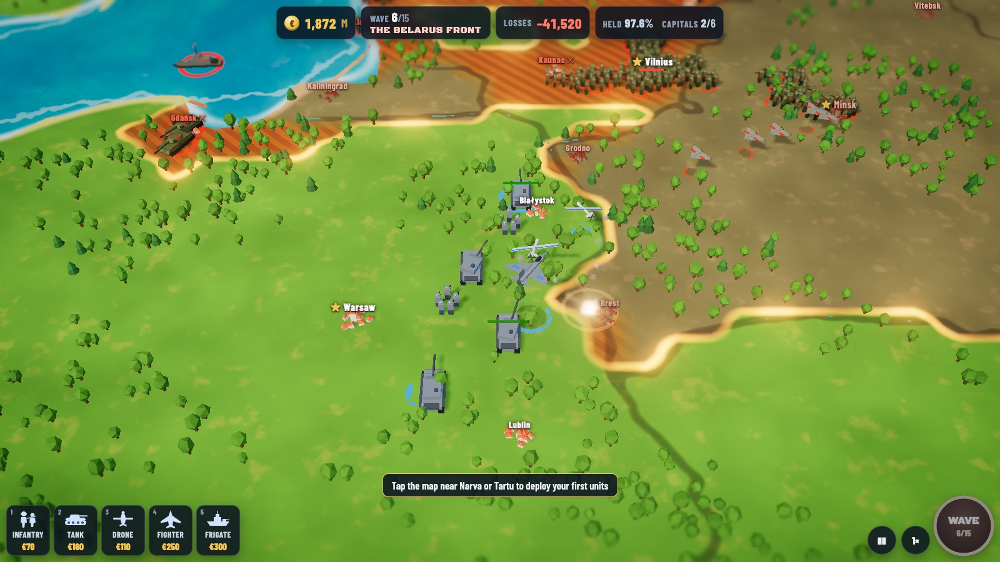
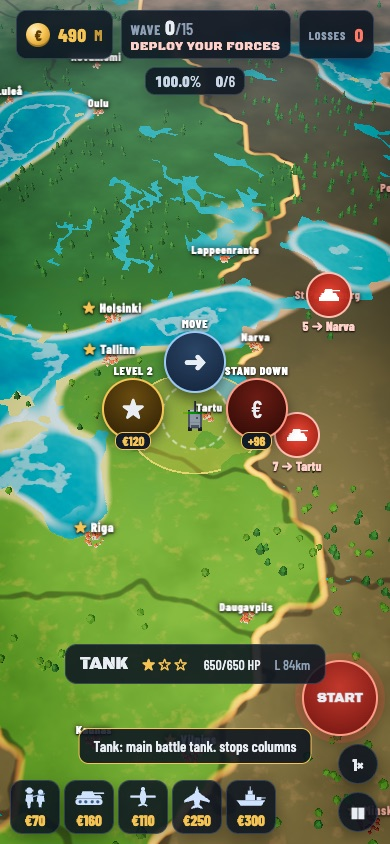
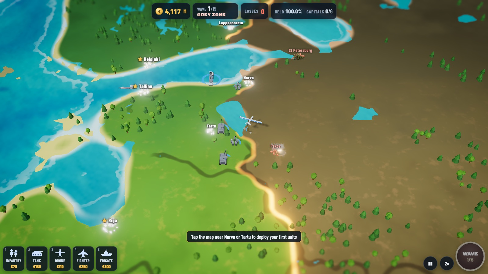

# Article 5

Hold Europe against a swarm from the east. Real-time strategy meets tower
defence, in the browser, on a phone or with a mouse.

It starts the way people expect it would: unmarked troops over the Estonian
border near Narva, supposed to look like nothing much. Each wave opens a front
or two more - Latvia, the Suwałki gap, the Baltic Fleet, Belarus, the Black Sea,
the Arctic - until wave fifteen, which is everything at once. You are always
NATO and Europe. You put tanks, infantry, drones, fighters and frigates in the
way, and the bill for everything you lose is your score.

No build step and no `npm install`. The only library is three.js (r186), in
`vendor/`, so the game runs offline and nothing is fetched while it plays.

**[Play it here](https://markclausing.github.io/webTA/)**





## Getting started

```bash
npm start            # http://localhost:8080
npm test             # the simulation and the score board, headless
npm run test:ui      # the real page, with a mouse and a finger (needs npm start)
```

## Playing

**Tap the map** to deploy. A ring of five units opens where you tapped, each
with its price; the ones that cannot go there are greyed out. Or pick a card from
the bar at the bottom (keys `1`–`5`) and tap where it should go.

| Unit | Where | Good against |
| --- | --- | --- |
| Infantry | our ground | rifle squads; **retakes ground**; MANPADS at level 3 |
| Tank | our ground | everything on the ground; **retakes ground** |
| Drone | over our ground or coast | armour and ships, from a loiter circle |
| Fighter | over our ground or coast | drones, missiles, bombers; bombs at level 2 |
| Frigate | open sea near our coast | ships, coasts and the sky; cruise missiles at level 3 |

**Tap one of your units** to upgrade it (three levels), move it, or stand it
down for part of what it cost - which is not counted as a loss. On a computer,
right click moves the selected unit.

**Drag** to move the map, **pinch** or **scroll** to zoom; a two-finger swipe
on a touchpad pans. `WASD`/arrows pan too, `Space` calls the next wave, `F`
changes speed, `Esc` pauses.

**The red markers** show where the next wave comes from, how many, and where
it is heading. Call a wave early - the big button, or tap a marker - and the
time you did not wait is paid out as budget.



### The war

- Enemy ground units **take every cell they cross** unless one of your ground
  units is close enough to contest it. Infantry and tanks **take it back**.
- A city under siege shows a red bar. If it falls it costs you, and it starts
  **raising troops** for the other side: the swarm grows from inside until you
  liberate it, which your ground units do by standing in it.
- Columns that take their city push on to the next one nearby. Ships put troops
  ashore. Shahed drones and Iskander missiles go for cities, and every one that
  gets through is charged.
- Lose too many capitals - six, on Veteran - and the war is over.

### The score

The score is what the war cost you, and lower is better:

| Lost | Charge |
| --- | --- |
| a 25 km square of ground | 60 (half back if you retake it) |
| a city | 1,500 |
| a capital | 4,000 (half back if you liberate it) |
| one of your units | 1.5 × what you spent on it |
| a drone or missile that gets through | 250 to 1,260 |

The board ranks by how many waves you held, then by fewest losses: a general who
saw the whole war through is above one who lost cheaply in wave three. There is
a list per difficulty.

## How it is built

```
src/game/      the war: 30 ticks a second, seeded, no DOM, runs in Node
  sim.js       units, combat, ground and cities changing hands, waves, the bill
  flow.js      flow fields for the swarm, A* for your units
  map.js       the 25 km grid: land, sea, countries, who started with what
  units.js     every unit on both sides, three levels for yours
  waves.js     the fifteen waves, and the three difficulties
  data/        europe.js, generated by tools/build-map.js
src/render/    three.js
  terrain.js   the land (real elevation, shader-painted) and the sea
  models.js    every unit built from primitives, with turrets and rotors
  unitview.js  one instanced draw per part per kind, however big the swarm
  fx.js        fire, smoke, tracers, missiles and shock rings
  camera.js    the table-top camera
src/ui.js      the HUD, radial menus, labels over the map
src/main.js    the loop, input, menus, sound, the score board
```

The map is Natural Earth (1:50m countries and lakes) and the Terrarium elevation
tiles, projected Lambert azimuthal equal-area so a square kilometre is a square
kilometre wherever you lose it. `tools/build-map.js` fetches them once into
`tools/.cache/` and writes `src/game/data/europe.js` and `assets/relief.png`.

The swarm does not plan routes: every target city has a distance field over the
grid, and three hundred units walk downhill on one array. Your units are few and
get A*.

The look is two halves. The units are Total Annihilation's: hard-edged,
flat-shaded, with turrets that track their target, rotors that spin and radars
that sweep. The map is Kingdom Rush's: saturated colour, chunky trees, painted
surf on every coast, team rings under every unit, and a tilt-shift blur that
makes a continent look like a table you could lean over.

Graphics quality picks itself and steps down if the frame rate drops; set it in
the menu or force it with `?quality=low|medium|high|ultra`.



## The score board

Kept in localStorage per browser. Point `DEFAULT_BOARD` in `src/config.js` at a
deployed copy of the Worker in `worker/` and every copy of the page shares one
board; `npm start` serves the same two calls locally. See `worker/README.md`.

## Tools

```bash
node tools/simtest.js --report     # the bot plays every difficulty, with the numbers
node tools/simtest.js --log        # one war, wave by wave
node tools/shot.js out.png         # a screenshot from headless Chrome (needs npm start)
node tools/make-icons.js           # the app icons
node tools/build-map.js            # rebuild the map from the sources
```
